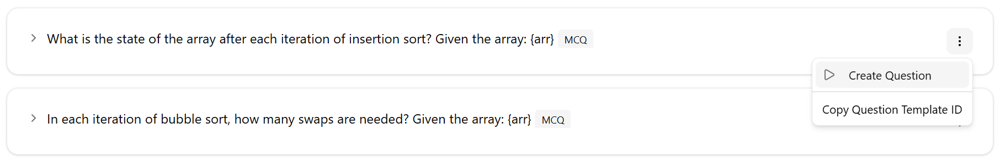
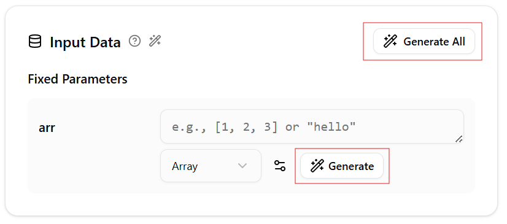
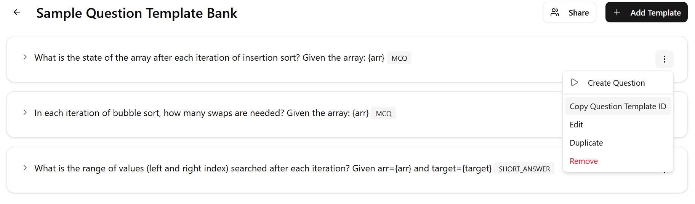
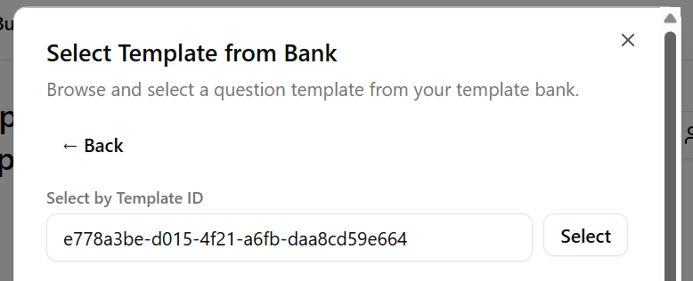
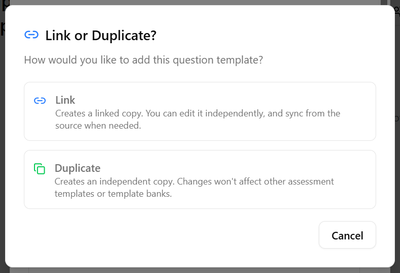
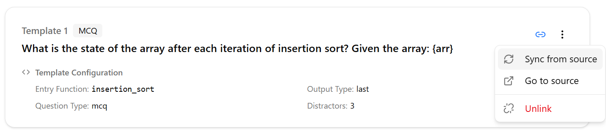
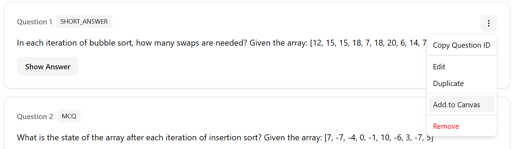

# Tutorials

## Template Builder Tutorial

Question templates act as blueprints for generating questions. Follow the steps below to create one:

1.	**Open the Template Builder**

    Navigate to the [Template Builder](https://edcraft.rizkiarm.com/template-builder) tab.

1.	**Input your algorithm code**
    
    Enter your algorithm using **Python** only.

    Example:

    ```python
    def insertion_sort(arr):
        for i in range(1, len(arr)):
            key = arr[i]
            j = i - 1
            while j >= 0 and key < arr[j]:
                arr[j + 1] = arr[j]
                j -= 1
            arr[j + 1] = key
    ```

3. **Analyse the Code**
    
    Click `Analyse Code` to examine the code structure and identify its components.

3.	**Configure the Target**

    The target determines how the answer will be extracted from your code.

    **Example scenario:**
    
    Question: "What is the state of the array after each iteration of insertion sort?"

    To obtain the answer, find the value of `arr` at the end of each iteration of the outer for loop.

    To achieve this, configure:

    * Loop: `for i in range(1, len(arr))`

    * Loop iterations:
        * Enables analysis of each iteration individually

    * View elements inside loop iterations:
        * Applies subseqent selections within each iteration

        
    
    * Variable `arr`

        

3.	**Set Output Type**
    
    Select `Last` to capture the final value of `arr` at the end of each loop iteration.

3. **Choose the Entry Function**

    Select `insertion_sort` as the entry function.
    
    This is the function where inputs are passed into your code.

    

3.	**Create a Question Template (Optional)**

    You can define a dynamic question using input variables.

    Example: "What is the state of the array after each iteration of insertion sort? Given the array: {arr}"

3. **Configure Input Generation**

    Set up input generation to generate inputs for the code.

    Example: Generate an integer array
    * Select `Array`
    * Define minimum and maximum number of elements
    * Choose `Integer` for item schema
    * Set minimum and maximum values for the integers

    

3.	**Provide Input Values**

    To generate a question preview.

    Either:
    * Generate inputs by clicking `Generate`, or
    * Enter custom values manually

3. **Preview the Template**

    Click `Generate Template Preview` to see the final output.

3. **Save Template**

## Generate Question from Template

1. **Open Question Creation Form**

    Click on `Create Question`

    

2. **Add input data**

    Provide the required inputs for the question:
    * If an input generator is configured:
        * Click `Generate All` to generate all inputs at once, or
        * Click `Generate` repeatedly to refine individual inputs
    * Otherwise, manually enter your input values

    

3. **Generate the Question**
    
    Click `Generate Question` to produce the final question.

## Link or Duplicate Question/Template

In this tutorial, we will explore the duplicate and linking mechanism using an Assessment Template and Question Template.

1. **Open an Assessment Template**

    Navigate to an Assessment Template (create one if needed).

2. **Add a Template**

    Click on `Add Template`.
    
    Click on `Select from Template Bank` (or Assessment Template)

3. **Copy the Question Template ID**

    In another tab, locate the desired template and copy its `Question Template ID`.

    

4. **Paste the Template ID**

    Paste the `question template ID` and click `Select`.

    

5. **Choose Link or Duplicate**

    Select one of the following:
    * Link – Reference the original template
    * Duplicate – Create an independent copy

    

    Linked templates can be edited without affecting the original.
    
    Changes to the original template are not applied automatically.
    
    Use `Sync` to update your version (this will overwrite your changes).

    

## Create Assessment from Template

In this tutorial, you will learn how to instantiate an assessment from an assessment template.

1. **Open an Assessment Template**

    Navigate to the desired Assessment Template.

2. **Instantiate the Assessment**

    Click on `Instantiate Assessment`.

3. **Enter Assessment Details**

    Provide the Assessment Title and optionally a description, then click Next.

4. **Configure Question Inputs**

    For each question template, provide the required inputs
    * If an input generator is configured:
        * Click `Generate All` to generate all inputs at once, or
        * Click `Generate` repeatedly to refine individual inputs
    * Otherwise, manually enter your input values

    

    Click on `Generate Question` to preview the result.

5. **Create the Assessment**

    Click `Create Assessment`.

## Upload to Canvas

In this tutorial, we will learn how to upload questions to Canvas quizzes.

To upload questions to Canvas, you will need to configure your Canvas settings.

1. **Open Canvas Settings**

    Click your profile icon, then select `Canvas Settings`.

2. **Enter Canvas domain**

    Input your `Canvas domain` (e.g., canvas.nus.edu.sg).

3. **Enter access token**

    Generate and paste your access token. Refer to this [guide](https://community.instructure.com/en/kb/articles/662901-how-do-i-manage-api-access-tokens-in-my-user-account#add-access-token) if needed.

4. **Save Settings**

    Click `Save`.

To upload your **entire assessment**,

1. **Open Upload Form**

    Click on `Upload to Canvas`.

2. **Select Course**

    Choose the course (only courses where you are a teacher will appear).

3. **Upload Assessment**

    Click `Upload to Canvas`. Your assessment will be uploaded as a new quiz.

To upload a **question**,

1. **Open Upload Form**

    Click the question options and select `Add to Canvas`.

    

2. **Select Course**

    Choose the course (only courses where you are a teacher will appear).

3. **Select or Create Quiz**

    Select an existing quiz, or create a new quiz

4. **Upload Question**

    Click `Upload to Canvas`.
